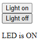

# Py Lights Project - Ollie Saunders
## Introduction
For my skills section of DofE, I have decided to spend 3 months learning Python, and my dad suggested using a Raspberyy Pi Pico to run VSCode

[Raspberry Pi Pico](https://www.raspberrypi.com/documentation/microcontrollers/pico-series.html)

The final aim is to make something to individually control LED and RGB Lights.

## Week 1 - 5/11/24

* We prepared VSCode to use as the editor.
* We also setup the Raspberry Pi Pico to run on VSCode by installing the required plugins/extensions.
* Additionally we linked setup a Github repository to store the code.
* We also copied a code to blink the LED to test the code was working

## Week 2 - 12/11/24

* We worked out how to control the Pico wirelessly using a website
* This involved using html to make a simple web page
* I also set up a hidden file to store Wi-Fi information, so they were not visible on Github

